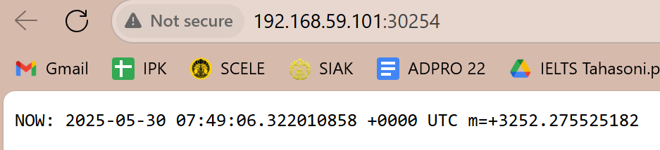

### Refleksi Adpro Modul 11 

#### Perbandingan Log Aplikasi Sebelum dan Sesudah Di-Expose sebagai Service
Sebelum aplikasi diekspos sebagai service, log aplikasi yang ditampilkan menggunakan perintah:
kubectl logs deployment/hello-node
hanya menunjukkan aktivitas awal dari container, dan belum terlihat adanya interaksi pengguna. Namun, setelah deployment diekspos sebagai service dengan perintah:
kubectl expose deployment hello-node --type=LoadBalancer --port=8080
minikube service hello-node
dan aplikasi dibuka beberapa kali melalui browser, log mulai menampilkan aktivitas tambahan setiap kali aplikasi diakses. Hal ini menunjukkan bahwa setiap permintaan dari browser berhasil diteruskan ke pod, dan interaksi tersebut terekam dalam log.

Kesimpulan: Jumlah log bertambah setiap kali aplikasi dibuka setelah diekspos, yang menandakan bahwa service berhasil meneruskan trafik ke aplikasi.

---

#### Perbedaan kubectl get Tanpa dan Dengan Opsi -n
Terdapat dua variasi perintah kubectl get yang digunakan dalam tutorial ini:

kubectl get pods
Menampilkan resource yang berada di namespace default, yaitu tempat aplikasi hello-node dijalankan.

kubectl get pods -n kube-system
Menampilkan resource di namespace kube-system, yang berisi komponen internal Kubernetes seperti coredns, kube-scheduler, dan metrics-server.

Namespace dalam Kubernetes berfungsi untuk mengelompokkan resource ke dalam ruang lingkup yang terpisah. Ketika perintah menggunakan -n kube-system, maka resource di namespace lain (seperti default) tidak akan terlihat.

Kesimpulan: Opsi -n digunakan untuk menentukan namespace tertentu. Tanpa opsi ini, kubectl hanya akan menampilkan resource dari namespace default.